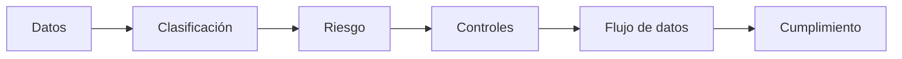

# Data Protection & Compliance

## Objetivo
Este repositorio reúne un análisis de **protección de datos y seguridad de la información aplicado al contexto de una aseguradora argentina**.

El trabajo parte de una pregunta simple:
> ¿Cómo identificar, clasificar y proteger la información que maneja una organización según el riesgo que representa su exposición?

Para responderla, se trabajó sobre cuatro aspectos principales:
- Clasificación de la información.
- Riesgos asociados a la exposición de los datos.
- Controles técnicos y organizacionales.
- Flujo de los datos dentro de una aseguradora.

Complementariamente, se analiza el marco legal argentino (**Ley 25.326**) y se realiza una comparación con el **GDPR** como referencia internacional.

## Caso de aplicación y enfoque
El análisis se plantea sobre una aseguradora argentina porque este tipo de organización maneja simultáneamente información pública, datos personales, información contractual, datos financieros y datos relacionados con la salud.

Por ejemplo, una misma base de datos puede contener información de pólizas considerada **Confidencial** y registros médicos considerados **Restringidos**. Una vulnerabilidad en un único componente podría exponer ambos tipos de información con impactos legales y de negocio muy distintos.

La propuesta del proyecto es conectar los aspectos regulatorios con decisiones técnicas de seguridad:



De esta forma, la organización pasa de saber únicamente qué datos posee a entender:
- Qué tan sensibles son.
- Qué impacto tendría su filtración.
- Dónde circulan y dónde se almacenan.
- Quién debe acceder a ellos.
- Qué controles técnicos deben protegerlos.
- Durante cuánto tiempo deben conservarse.

## Estructura del proyecto

El análisis se divide en cinco documentos complementarios:

```text
data-protection-compliance/
│
├── README.md
│
└── docs/
    ├── data-classification.md    # Matriz de clasificación de 4 niveles y análisis de riesgo
    ├── security-controls.md      # Controles técnicos y organizacionales por nivel
    ├── data-flow.md              # Recorrido del dato, amenazas por etapa y puntos de control
    ├── ley-25326.md              # Marco legal argentino de protección de datos personales
    └── gdpr-comparacion.md       # Comparación entre la Ley 25.326 y el estándar europeo
```

---

### [1. Clasificación de datos](docs/data-classification.md)
Define una matriz de clasificación adaptada a una aseguradora en cuatro niveles: **Público**, **Interno**, **Confidencial** y **Restringido**. Analiza el impacto legal, reputacional y financiero de una exposición, ilustrado con el incidente real de ransomware a *La Segunda Seguros* (2023) y un caso práctico de SQL Injection.

### [2. Controles de seguridad](docs/security-controls.md)
Detalla los controles técnicos y organizacionales necesarios para mitigar el riesgo en cada nivel de clasificación: cifrado (en reposo y en tránsito), RBAC, MFA, DLP, logging/monitoring, retención y destrucción segura.

### [3. Flujo de datos](docs/data-flow.md)
Analiza el recorrido de la información desde su ingreso por la web hasta su almacenamiento en bases de datos, backups, logs y reportes. Identifica los riesgos específicos de cada etapa y los puntos críticos de control.

### [4. Ley 25.326 (Argentina)](docs/ley-25326.md)
Sintetiza las obligaciones legales, principios de calidad y finalidad, derechos de los titulares (acceso, rectificación, supresión), transferencias internacionales y las exigencias de seguridad del régimen argentino.

### [5. Comparación Ley 25.326 vs. GDPR](docs/gdpr-comparacion.md)
Contrasta el régimen argentino con el Reglamento General de Protección de Datos europeo, destacando diferencias clave en datos sensibles, el principio de *accountability*, medidas de seguridad y gestión de brechas.

---

## Marco de referencia
El trabajo toma como base:
- **Ley 25.326** — Protección de los Datos Personales (Argentina).
- **Resolución AAIP 47/2018** — Medidas de seguridad recomendadas para el tratamiento de datos personales.
- **ISO/IEC 27001:2022** — Control A.5.12 (Clasificación de la información).
- **NIST SP 800-60** — Guía para mapear tipos de información a categorías de impacto en seguridad.
- **GDPR (Reglamento UE 2016/679)** — Marco internacional de referencia.
