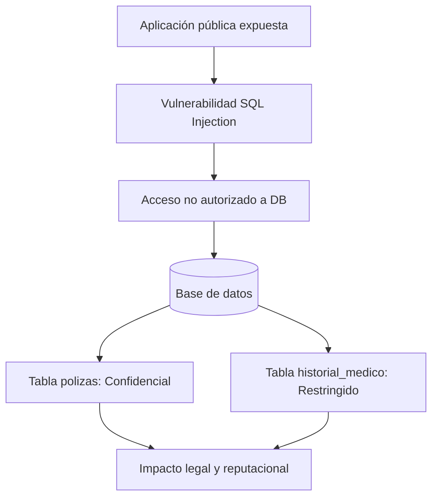

# Matriz de Clasificación de Datos — Aseguradora Argentina

## Marco de referencia
Para definir la clasificación de los datos se tomaron como referencia cuatro fuentes:
- **ISO/IEC 27001:2022 — Control A.5.12:** clasificación de la información según las necesidades de confidencialidad, integridad y disponibilidad.
- **NIST SP 800-60:** categorización de la información según el impacto que tendría su compromiso sobre los objetivos de seguridad.
- **Ley 25.326 + AAIP:** marco legal argentino para la protección de datos personales y definición de datos sensibles.
- **Resolución AAIP 47/2018:** medidas de seguridad recomendadas para el tratamiento y conservación de datos personales en medios digitales.

A partir de estas referencias, se propone una clasificación de cuatro niveles adaptada a la operativa de una aseguradora argentina.

La clasificación no se realiza simplemente según el tipo de dato, sino teniendo en cuenta principalmente **qué impacto tendría para la organización y para los titulares si esa información fuera expuesta, modificada o utilizada sin autorización**.

## Niveles de clasificación

| Nivel | Definición | Criterio de clasificación |
|---|---|---|
| **Público** | Información que puede divulgarse sin restricciones. Su exposición no genera un impacto significativo. | Información destinada a comunicación externa. |
| **Interno** | Información destinada al uso interno de la organización. Su exposición externa puede generar inconvenientes, pero no representa un impacto grave. | Procesos internos y documentación operativa no sensible. |
| **Confidencial** | Información cuyo acceso debe estar restringido. Su exposición puede generar un perjuicio significativo para la empresa, sus clientes o terceros. | Datos de clientes, pólizas, contratos e información financiera. |
| **Restringido** | Información cuyo acceso debe estar extremadamente limitado. Su exposición puede generar consecuencias graves, incluyendo riesgos legales o regulatorios. | Datos sensibles, credenciales y claves criptográficas. |

La clasificación debe determinarse considerando **qué sucedería si la información se filtrara** y no únicamente el nombre del archivo o campo.

## Ejemplos para una aseguradora

| Nivel | Ejemplos |
|---|---|
| **Público** | Sitio web institucional, folletos de productos, cotizaciones estándar publicadas, datos de contacto comercial. |
| **Interno** | Organigrama, manuales internos de procedimientos, agendas de reuniones, presupuestos operativos no aprobados. |
| **Confidencial** | Número de póliza, cobertura, prima, vigencia, nombre del cliente, DNI, domicilio, teléfono, correo electrónico, historial de siniestros, contratos con proveedores, estados financieros. |
| **Restringido** | Historias clínicas, diagnósticos, peritajes médicos de asegurados, información judicial, datos biométricos, credenciales de sistemas, claves de cifrado de backups, legajos y evaluaciones de desempeño. |

Un mismo tipo de información puede requerir distintos niveles de protección según el contexto.

En particular, la **Ley 25.326** define como datos sensibles aquellos que revelan información relativa a la salud. Esto resulta crítico para una aseguradora, ya que maneja información médica de forma habitual durante la suscripción de pólizas de vida o la liquidación de siniestros y accidentes laborales (ART).

Por este motivo, los datos de salud se consideran **Restringidos** dentro de esta clasificación.

## Análisis de riesgo e impacto por nivel

La clasificación permite evaluar las consecuencias de una eventual filtración en tres dimensiones: legal, reputacional y financiera.

### Público
- **Riesgo de exposición:** Bajo. La información está destinada a ser pública.
- **Impacto legal:** Nulo, no involucra datos personales protegidos.
- **Impacto reputacional:** Bajo.
- **Impacto financiero:** Bajo.

### Interno
- **Riesgo de exposición:** Bajo a medio. La información no es pública, pero no compromete directamente a clientes.
- **Impacto legal:** Generalmente bajo, salvo que incluya propiedad intelectual o secretos comerciales.
- **Impacto reputacional:** Medio. Puede revelar métodos de trabajo o vulnerabilidades operativas.
- **Impacto financiero:** Limitado, aunque puede facilitar ataques de ingeniería social o reconocimiento interno.

### Confidencial
- **Riesgo de exposición:** Alto. Involucra datos personales, contractuales o financieros de clientes y de la compañía.
- **Impacto legal:** Incumplimiento de las obligaciones de la Ley 25.326 respecto al deber de seguridad y confidencialidad.
- **Impacto reputacional:** Alto, con pérdida de confianza de los asegurados.
- **Impacto financiero:** Costos de notificación, posibles sanciones administrativas, reclamos por daños y pérdida de clientes.

### Restringido
- **Riesgo de exposición:** Muy alto. Involucra datos sensibles o secretos técnicos que permiten comprometer la infraestructura.
- **Impacto legal:** Infracciones graves ante la AAIP por falta de tutela sobre datos sensibles, posibles acciones judiciales civiles y penales.
- **Impacto reputacional:** Crítico, con cobertura mediática negativa y daño severo a la marca.
- **Impacto financiero:** Costos elevados de respuesta al incidente, litigios, recuperación forense de sistemas y pérdida directa de operaciones.

### Variable de volumetría en el impacto
El impacto no depende únicamente del nivel de clasificación, sino también del **volumen de registros comprometidos**.

No representa el mismo riesgo la filtración de un legajo médico individual que la exfiltración de la base completa de asegurados con diagnósticos de los últimos cinco años. A mayor volumen de datos concentrados, mayor es la severidad del incidente y la probabilidad de daño colectivo.

## Controles según nivel de clasificación

Cada nivel exige controles proporcionales a su criticidad. El detalle técnico y la justificación de cada medida se profundizan en el documento de [Controles de Seguridad](security-controls.md).

| Nivel | Controles técnicos principales | Controles organizacionales |
|---|---|---|
| **Público** | Publicación web protegida, controles básicos de integridad y disponibilidad. | Aprobación de comunicaciones antes de su publicación. |
| **Interno** | Autenticación centralizada, control de acceso y DLP básico. | Etiquetado de información y políticas internas de uso aceptable. |
| **Confidencial** | Cifrado en reposo y en tránsito, RBAC, MFA, DLP y registro de accesos (logs). | Acceso por necesidad de conocer (*need to know*), cláusulas de confidencialidad y capacitación periódica. |
| **Restringido** | Cifrado reforzado, segmentación de red, tokenización, MFA obligatorio, backups aislados, monitoreo con SIEM y FIM. | Autorización nominal documentada, auditorías trimestrales de privilegios y protocolo de destrucción segura. |

## Contexto: incidente de ransomware en el sector asegurador argentino
Un caso que permite relacionar estos conceptos con una situación real del sector asegurador local es el ataque sufrido por **La Segunda Seguros en febrero de 2023**.

La compañía fue víctima de un ataque de ransomware atribuido públicamente al grupo **LockBit**. Durante el incidente se produjo el cifrado extorsivo de sistemas y posteriormente se filtraron datos exfiltrados de la organización.

Entre la información expuesta se encontraban documentos vinculados a medicina laboral y siniestros: diagnósticos médicos, peritajes psicológicos, expedientes judiciales y datos personales de clientes y empleados.

Este caso demuestra que una aseguradora maneja información en todos los niveles de riesgo dentro de los mismos sistemas:
- **Datos personales de clientes y pólizas:** Confidencial.
- **Información médica y peritajes:** Restringido.
- **Expedientes judiciales y denuncias:** Restringido.
- **Credenciales y accesos de sistemas:** Restringido.

Clasificar previamente la información permite priorizar qué activos aislar, dónde aplicar cifrado fuerte y qué accesos restringir con mayor urgencia.

## Caso práctico: exposición de datos mediante SQL Injection
Consideremos un atacante que compromete una aplicación web de la aseguradora a través de una vulnerabilidad de **SQL Injection**.

Si la base de datos almacena información operativa y médica sin una adecuada separación lógica o permisos segmentados, una sola vulnerabilidad técnica permite saltar entre niveles de clasificación:

<table>
<tr>
<td valign="top">

### `polizas`

| Campo | Clasificación |
|---|---|
| `numero_poliza` | Confidencial |
| `dni` | Confidencial |
| `cobertura` | Confidencial |
| `prima` | Confidencial |
| `vigencia` | Confidencial |

</td>
<td valign="top">

### `historial_medico`

| Campo | Clasificación |
|---|---|
| `dni` | Confidencial |
| `diagnostico` | Restringido |
| `tratamiento` | Restringido |
| `observaciones_medicas` | Restringido |

</td>
</tr>
</table>

La tabla `polizas` contiene datos **Confidenciales**, mientras que `historial_medico` contiene datos de salud clasificados como **Restringidos**.

Si el usuario de base de datos que utiliza la aplicación web tiene permisos de lectura sobre ambas tablas, la explotación del SQLi compromete simultáneamente ambos niveles.

Para mitigar este riesgo no solo se requiere sanitización de entradas y consultas parametrizadas, sino también controles derivados de la clasificación: **mínimo privilegio a nivel de base de datos (RBAC)**, de modo que el servicio web público nunca tenga permisos sobre tablas con información restringida.

### Relación con MITRE ATT&CK
En el marco de un SOC, este vector se asocia a la técnica **MITRE ATT&CK T1190 — Exploit Public-Facing Application**.

## Recomendaciones de implementación

1. **Inventariar los datos:** Identificar qué información personal, financiera y médica existe en la aseguradora y en qué repositorios reside.
2. **Asignar la clasificación:** Etiquetar cada conjunto de datos justificando el nivel asignado según su impacto ante una filtración.
3. **Aplicar controles proporcionales:** Cifrado, segmentación y autenticación multifactor según el nivel del dato, tal como se analiza en [security-controls.md](security-controls.md).
4. **Mapear el recorrido:** Entender por qué sistemas y servicios transita cada dato utilizando un mapa de [flujo de datos](data-flow.md).
5. **Aislar y proteger backups:** Mantener copias de seguridad desconectadas o inmutables para que un incidente de ransomware no comprometa la recuperación del negocio.

## Glosario

| Término | Definición |
|---|---|
| **AAIP** | Agencia de Acceso a la Información Pública. Autoridad de aplicación de la Ley 25.326 en Argentina. |
| **DLP** | Data Loss Prevention. Herramientas y políticas para detectar y bloquear la salida no autorizada de datos. |
| **RBAC** | Role-Based Access Control. Control de acceso basado en el rol de cada usuario dentro de la compañía. |
| **FIM** | File Integrity Monitoring. Monitoreo de integridad de archivos para alertar cambios no autorizados en archivos críticos. |
| **SIEM** | Security Information and Event Management. Plataforma de correlación y análisis centralizado de eventos de seguridad. |
| **MFA** | Multi-Factor Authentication. Mecanismo que exige dos o más factores independientes para autenticar una identidad. |
| **WAF** | Web Application Firewall. Filtro perimetral que inspecciona tráfico web para bloquear ataques comunes como SQLi y XSS. |

## Conclusión
La clasificación de datos permite salir del enfoque reactivo y aplicar una protección basada en riesgo real.

El caso de *La Segunda* evidencia que el impacto de una intrusión en una aseguradora no radica únicamente en la indisponibilidad temporal de los servidores, sino en la exposición masiva de información confidencial y sensible de los asegurados.

Vincular la clasificación con el riesgo operativo y legal es el paso indispensable antes de definir controles técnicos o analizar el flujo de los datos en la arquitectura.