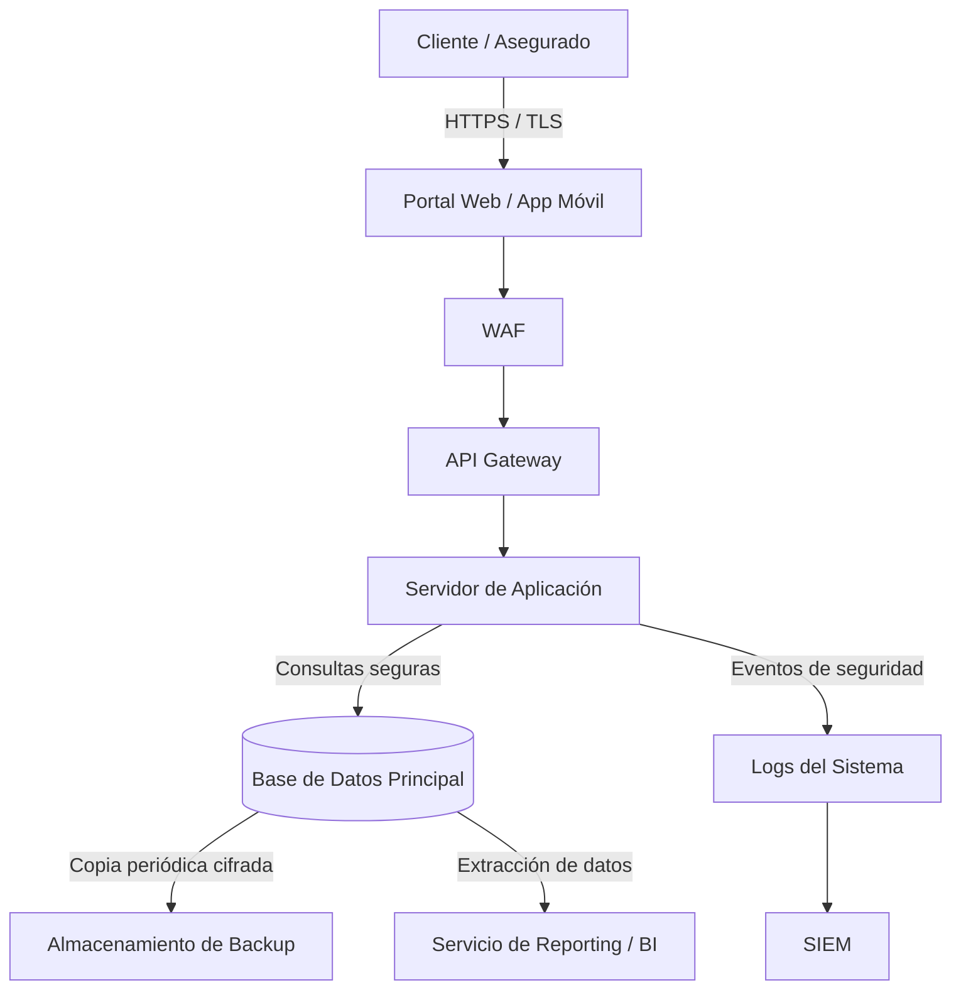

# Flujo de Datos — Aseguradora Argentina

## Objetivo
El objetivo de este documento es identificar el recorrido que realizan los datos dentro de una aseguradora: desde que son ingresados por el asegurado hasta que se procesan, almacenan, respaldan o utilizan para generar reportes.

Analizar el flujo permite determinar en qué componentes residen los datos, qué nivel máximo de clasificación alcanzan en cada tramo y qué controles de [security-controls.md](security-controls.md) deben implementarse para reducir el riesgo de exposición.

## Arquitectura y flujo general

El siguiente esquema representa el flujo típico de información dentro de los servicios digitales de una aseguradora:

## Recorrido del dato por etapas

### 1. Entrada de datos (Cliente → Web)
El usuario ingresa información a través de formularios en el portal o la aplicación móvil:
- Datos personales y de contacto (DNI, domicilio, teléfono).
- Información de bienes a asegurar (vehículos, inmuebles).
- Denuncias de siniestros y documentación adjunta.
- Información médica en seguros de vida o accidentes laborales.

En este punto conviven datos **Confidenciales** con datos **Restringidos** (salud). El canal de comunicación debe estar protegido mediante TLS para evitar la intercepción de credenciales o información en tránsito.

### 2. Procesamiento e intermediación (Web → WAF → API → Servidor de Aplicación)
Las peticiones atraviesan los componentes de intermediación:
- El **WAF** filtra intentos de explotación comunes (inyecciones, ataques de denegación de servicio a nivel aplicativo y tráfico malicioso automatizado).
- El **API Gateway** y el **Servidor de Aplicación** validan la identidad del usuario, verifican tokens de sesión y aplican reglas de negocio antes de consultar la base de datos.
- En este tramo los riesgos principales son la manipulación de parámetros, el abuso de autorización de endpoints (**BOLA**) y la inyección de código.

### 3. Almacenamiento persistente (Servidor → Base de Datos)
La base de datos almacena tanto la información contractual como los datos de salud de los asegurados.
- Constituye el activo más crítico de la arquitectura.
- Requiere controles de **cifrado en reposo**, mínimo privilegio en las cuentas de conexión de la aplicación y segmentación de red para que el motor de base de datos no tenga exposición directa a Internet.

### 4. Respaldo (Base de Datos → Backup)
La información se replica periódicamente a repositorios de backup:
- Los respaldos contienen copias exactas de datos Confidenciales y Restringidos.
- Representan un vector habitual en incidentes de ransomware: si un atacante compromete los backups, puede extorsionar con la filtración masiva o destruir las copias para impedir la recuperación del negocio.
- Requieren **cifrado con claves independientes**, almacenamiento inmutable o desconectado (*air-gap*) y acceso estrictamente restringido.

### 5. Generación de registros (Servidor → Logs → SIEM)
La aplicación y los servicios perimetrales generan registros de actividad:
- Permiten auditar quién consultó o modificó determinada póliza o historial médico.
- Los logs deben protegerse para evitar que contengan información sensible en texto plano (como contraseñas o diagnósticos) y deben ser inmutables para garantizar su validez en investigaciones forenses.

### 6. Reportería y análisis (Base de Datos → Reporting)
La información se utiliza internamente para análisis de siniestralidad, balance financiero y auditoría:
- Debe aplicarse el principio de **mínimo privilegio**: las áreas administrativas o comerciales deben acceder a reportes agregados o datos disociados, sin visibilidad sobre diagnósticos médicos.

## Análisis de riesgo por etapa

| Etapa | Datos que transitan | Nivel máximo | Riesgo principal | Control técnico clave |
|---|---|---|---|---|
| **Cliente → Web** | Credenciales, datos personales, denuncias | Restringido | Intercepción de tráfico, robo de credenciales | Cifrado TLS 1.3, MFA, Rate limiting |
| **Web → WAF → API** | Solicitudes autenticadas, tokens | Confidencial | Explotación de vulnerabilidades expuestas, abuso de APIs | WAF, validación estricta de esquemas |
| **API → Servidor App** | Datos de negocio en procesamiento | Restringido | Falla de autorización (BOLA), ejecución indebida | RBAC a nivel de servicio, tokens firmados |
| **Servidor → Base de Datos** | Registros de pólizas, clientes y salud | Restringido | Inyección SQL, acceso no autorizado a tablas sensibles | Consultas parametrizadas, mínimo privilegio en DB, segmentación |
| **Base de Datos → Backup** | Copias completas del repositorio | Restringido | Cifrado malicioso por ransomware, robo de copias | Backups inmutables, cifrado independiente, aislamiento |
| **Servidor → Logs → SIEM** | Trazas de auditoría y eventos | Interno / Confidencial | Manipulación de evidencias, exposición de datos en logs | Envío centralizado a SIEM, enmascaramiento de datos |
| **Base de Datos → Reporting** | Datos analíticos y operativos | Confidencial | Fuga interna por exceso de privilegios | Control de acceso por rol (RBAC), disociación de datos |

El **nivel máximo** determina el estándar de seguridad que debe exigirse a todo el componente: si por una etapa transita un solo dato Restringido, el canal debe configurarse para proteger ese nivel de criticidad.

## Puntos críticos de riesgo en la aseguradora

1. **Exposición de copias de seguridad:** Como se observó en el incidente de *La Segunda Seguros*, los repositorios de archivos y backups suelen ser el objetivo principal de los atacantes para exfiltrar volúmenes masivos de datos sin interactuar tabla por tabla con la base de datos de producción.
2. **Exceso de privilegios en el acceso interno:** Si el personal de atención al cliente puede ver información médica asociada a un siniestro sin que su tarea lo justifique, se incumple el principio de necesidad de conocer y se amplía la superficie de fuga.
3. **Retención documental excesiva:** Conservar expedientes de siniestros finalizados durante más tiempo del exigido por ley incrementa el volumen de datos expuestos ante cualquier compromiso de almacenamiento.

## Conclusión
La clasificación de datos cobra sentido práctico cuando se proyecta sobre el flujo arquitectónico.

No basta con definir que una historia clínica es un dato Restringido: es indispensable verificar que viaje cifrada por TLS, que el servidor web no tenga permisos directos para leerla sin autenticación estricta, que no quede guardada en texto plano en los logs de la aplicación y que sus copias de seguridad estén aisladas contra ransomware.
